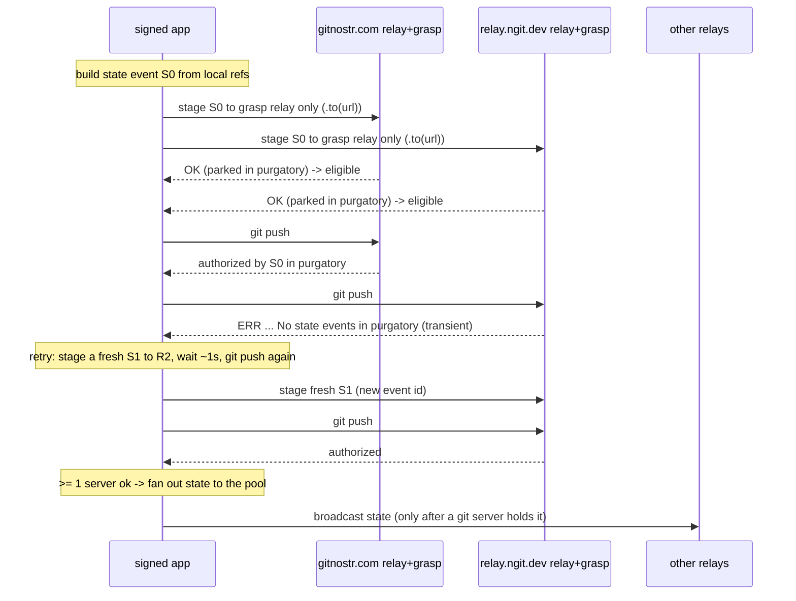

# Plan: reliable pushes to multiple grasp servers

Status: implemented (2026-09-07), see the change summary below.

A push to a repo announced with several grasp servers sometimes reaches only
one of them. The grasp server on `relay.ngit.dev` rejected the git push with
`remote: ERR authorisation failed: No state events in purgatory`, while
`gitnostr.com` accepted it. The push still reported success because the app
counts an operation as pushed when at least one grasp server accepted;
individual failures only hit the log as `WARN grasp push failed: ...`. The
failed server silently stays behind until something pushes to it again.

## Background: how a grasp push is authorized

A push to a GRASP server is a two-stage transaction, not a plain git push:

1. The client publishes a NIP-34 kind-30618 *state event* listing the refs it
   is about to push (`refs/heads/main -> <sha>` etc.).
2. The client git-pushes the objects to `https://<host>/<owner>/<repo>.git`.

The grasp server does not trust the git push on its own. State events it
accepts are held in an in-memory **purgatory** - accepted but not served,
"until git data arrives" - and the git push is authorized **only against
purgatory state events**, never against the database (the database is the
current state; purgatory holds the intended future state). When a push arrives
and purgatory holds no state event for that repo id, the server rejects with
`No state events in purgatory` (ngit-grasp `git/authorization.rs`), surfaced to
the client through the git protocol as the `remote: ERR authorisation failed:
...` line above. Parked events that are never matched by git data are discarded
after ~30 minutes.

The relay and the git server of a grasp entry share a host: `wss://gitnostr.com`
and `wss://relay.ngit.dev` are relay URLs, and the git URL is derived with
`grasp_base_url` (`https://<host>/<owner>/<repo>.git`). The grasp learns about
state events from its own relay. A relay accept for a state event parks it in
purgatory before the grasp sends its OK, and the nostr-sdk default ack policy
(`AckPolicy::all`) waits for that OK - so a confirmed stage means the state is
in place to authorize the push.

## Root causes in the app

| # | Problem | Consequence |
|---|---|---|
| 1 | State event is published to the whole relay pool, then git is pushed to every grasp server - no per-server staging, no confirmation that the target grasp's own relay accepted it | a push can reach a grasp whose purgatory is still empty |
| 2 | No retry for that denial class | a self-resolving race permanently leaves one server behind |
| 3 | `push_to_grasp_servers` returns `Ok` when >= 1 server accepts; failures only `log::warn!` | UI shows success; the failed grasp silently out of sync |
| 4 | When a grasp's relay is down, the client still fires a doomed git push | confusing git-level `ERR` instead of a clear "state not accepted by relay" |

Relevant code (`crates/signed_state/src/backend.rs`):

- `push_repo_from` (L752-834): broadcast the state event to the whole pool,
  then `push_to_grasp_servers`.
- `push_to_grasp_servers` (L1536-1570): sequential git pushes, `Ok` when at
  least one server accepted, `warn!` per failure.
- `broadcast_event` (L1336-1350): whole-pool `client.send_event`, errors only
  when no relay accepted.
- `send` / `publish_task` (L1239-1292): sign, broadcast, store locally (the
  client saves accepted events), emit `BackendEvent::Published`.
- `create_repository` (L554-575) and `publish_local_repo` (L692-708): direct
  `push_to_grasp_servers` calls; retract announcement+state when zero servers
  accept.

The fix mirrors ngit's own client (its `state_transaction.rs` stages the state
event on the grasp relays, gates which servers are pushed, and fans the state
out to other relays only after a git server accepted) and adds retries, because
the app must also cope with a denial after a relay ack.

## Target flow: staged push with retries



Retries stage a **fresh** state event (new `created_at` -> new id) rather than
resending the same one: a grasp relay treats a same-id event as a duplicate and
will not re-run its policy, so a lost purgatory entry (e.g. a server restart
without its state file) cannot be re-parked by a resend. A fresh id re-runs
validation and re-parks. Superseded parked events expire server-side after 30
minutes, so the residue is bounded.

## Changes

Implemented:

- `crates/signed_state/src/backend.rs`: `push_to_grasp_servers` replaced by the
  staged orchestration `push_staged_to_grasps` plus `stage_event_on_relay`,
  `sign_state_event`, `is_transient_grasp_denial`, and the `GraspServerResult` /
  `PushOutcome` result types. `create_repository`, `publish_local_repo` and
  `push_repo_from` (repo push and checkout push) all push through it and fan the
  state out to the relay pool only after at least one git server accepted.
- `crates/signed_state/src/repo.rs`: push outcomes surface partial failures as
  `RepoStore::last_push_warning`.
- `crates/workspace/src/views/repo_detail/mod.rs`: a warning banner with a
  Republish action shows when a push did not reach every grasp server.
- Unit tests for the denial classifier and the outcome reporting.

Decisions taken while implementing:

- State events are no longer broadcast before any git data exists. They are
  staged per grasp relay, and only fanned out to the relay pool after a git
  server accepted. A total push failure therefore leaves nothing served to
  retract except the announcement (create/publish flows retract that, as
  before). Staged-but-unmatched state events expire in the grasp's purgatory
  after ~30 minutes.
- Servers whose relay rejects the state event are **skipped**, not pushed
  (the eligibility gate): a doomed git push would only produce the same
  denial.
- **Stale-ref races are retried and verified.** The grasp server runs its own
  background sync that aligns repository refs to parked state events as soon
  as the git objects are present - including objects an earlier denied attempt
  of this same push already uploaded. `git receive-pack` then rejects the ref
  update against its stale advertisement with `cannot lock ref ... is at ...
  but expected ...` / `incorrect old value provided`. Such rejections are
  retried against a fresh advertisement *and* probed for convergence: when
  the sync already aligned the refs to this push's target (`git ls-remote`
  matches, `signed_git::remote_has_refs`), the server is counted as accepted
  even though the push's compare-and-swap never returned `Ok` - because the
  data is already there. The sync can land a moment after the retry window, so
  the probe is what makes these pushes succeed without a manual republish.
- Create/publish partial failures (some servers accepted, some not) stay
  `Ok` and are logged, matching the pre-existing contract; the repo-push
  paths additionally set `last_push_warning` so the failure is visible and
  one-click republishable.
- The push warning lives in a dedicated `RepoStore::last_push_warning` so it
  never collides with the PR-flow `last_warning` on the shared store.

### Staged orchestration (`crates/signed_state/src/backend.rs`)

1. **Per-relay publish helper** (`stage_event_on_relay`). Publishes only to
   one relay and verifies its acceptance, using the pinned nostr-sdk 0.45 API
   (`send_event_to` is deprecated at 0.45):

   ```rust
   // client.send_event(event).to([relay.clone()]).await
   // -> Ok only when the relay is in the output's success map
   ```

   The relay is added and connected first (reusing the `add_relay` pattern);
   a failed connect is a staged failure with a clear reason.

2. **Transient-denial classifier** (`is_transient_grasp_denial`, pure,
   unit-tested). Two retry families:

   - **Purgatory denials** (ngit-grasp `git/authorization.rs`):
     - `No state events in purgatory` (the originally reported failure)
     - `no matching state event found in purgatory`
     - `in purgatory ... doesn't match push`
     - `none from authorized publishers`
     - `No repository announcement found` (new repos whose announcement is
       still propagating)
   - **Stale-ref races** (git receive-pack compare-and-swap against the
     advertised value, when the grasp's background sync moved the ref):
     - `cannot lock ref`
     - `incorrect old value provided`

   Stale-ref race rejections are additionally probed for convergence with
   `git ls-remote`; a server that already advertises the pushed refs counts as
   accepted (`remote_has_refs` in `signed_git`).

   Everything else - HTTP auth rejection, not a maintainer, a genuine
   non-fast-forward divergence, network failure - is permanent for that
   attempt. Only the transient classes are retried.

3. **Orchestration** (`push_staged_to_grasps`, replaces `push_to_grasp_servers`):

   ```rust
   pub struct GraspServerResult { relay: RelayUrl, git_url: String, reason: Option<String> }
   pub struct PushOutcome { servers: Vec<GraspServerResult>, state_event: Option<Event> }

   async fn push_staged_to_grasps(
       client: &Client,
       signer: &UniversalSigner,
       repo_id: &str,
       refs: &[(String, String)],
       head: Option<&str>,
       path: &Path,
       owner: &str,
       servers: &[RelayUrl],
       push: fn(&Path, &str, &str, &str) -> Result<(), Error>,
   ) -> PushOutcome
   ```

   Per server, in `servers` order:

   - **Stage**: publish the state event to that relay (one retry for a connect
     blip). Not accepted => record the reason and skip the git push (the
     eligibility gate - no doomed push).
   - **Push**: git push; on a transient denial, stage a **fresh** state event
     (see below), back off ~1s, and retry. Budget: three attempts total.
   - Permanent git error => record it and stop for that server.

   Retries stage a fresh event (new `created_at` -> new id) rather than
   resending the same one: a grasp relay treats a same-id event as a duplicate
   and will not re-run its policy, so a lost purgatory entry (e.g. a server
   restart without its state file) cannot be re-parked by a resend. When a
   retry would fall in the same wall-clock second, `sign_state_event` nudges
   `created_at` forward by one second so the event id differs. Superseded
   parked events expire server-side after 30 minutes.

4. **Reorder `push_repo_from`**: replace the pre-push whole-pool `send(state)`
   with staging + push through `push_staged_to_grasps`, then, after at least
   one server accepted, fan the state out to the pool (`broadcast_event`) and
   emit `BackendEvent::Published` once. Moving the fan-out after the first git
   success also closes today's leak where state is broadcast before any server
   holds the objects (ngit made the same change).

5. **Other callers updated** (`create_repository`, `publish_local_repo`): same
   orchestration. Their announcement broadcast stays first - grasps park
   brand-new announcements in announcement purgatory until the first git data,
   so there is no leak - and "zero servers accepted => retract announcement" is
   preserved. An empty repository (no refs) is announced without staging or
   pushing anything.

### Outcome plumbing (`crates/signed_state/src/repo.rs`)

- `RepoStore::push_repository` / `push_checkout` (L1075-1150) gain

  ```rust
  last_push_warning: Option<String>
  ```

  populated from `PushOutcome::partial_warning()` (a one-line summary naming
  the rejected servers and reasons). `last_error` (zero-success hard failure)
  and the PR-flow `last_warning` are unchanged.

### UI (`crates/workspace/src/views/repo_detail/mod.rs`)

- When `store.last_push_warning` is set, `render_push_warning_banner` shows a
  warning banner above the header:

  > Pushed to 1 of 2 grasp servers: wss://relay.ngit.dev: remote: ERR
  > authorisation failed: No state events in purgatory fatal: ... Republish to
  > sync.

- The banner's Republish action reuses `push_repository` (an idempotent
  re-push of every announced server - the simplest catch-up for any drifted
  server); a dismiss control clears the warning.
- Zero-success failures continue through the existing error banner (`self.error`
  / `store.last_error`, rendered in `render`).

### Tests

- Unit (backend tests module): the classifier (both retry families - the
  reported purgatory stderr line and the reported `cannot lock ref` race are
  transient; HTTP 403, not-a-maintainer and a non-fast-forward divergence are
  not), the outcome reporting (partial warnings are single-line and name the
  failing servers, an all-ok outcome has no warning) and `flatten_whitespace`.
  All `cargo test -p signed_state` tests pass.
- The staged orchestration itself is exercised against live grasps by manual
  validation; the pure decision helpers are unit-tested.

### Manual validation

- Create and push a repo with both `gitnostr.com` and `relay.ngit.dev`; after
  each push, `git ls-remote https://<host>/<npub>/<repo>.git` against **both**
  hosts to confirm convergence; repeat over several commits to shake out the
  race. Then repeat with `relay.ngit.dev` temporarily unreachable to exercise
  the banner and the Retry action.

## Behavior decisions

- At least one server accepted => the operation succeeds (existing contract),
  but partial failure is explicit and retryable (warning banner + Republish).
- Announcement publishing stays first; state fan-out moves after the first git
  success (fixes the state-before-data leak).
- No wire-protocol changes; error text stays user-readable in the banner.

## Open questions (status)

1. **Auto-retry** after a partial success: not implemented - retries happen
   inside the push (up to 3 attempts per server for transient denials), and a
   residual failure stays visible with a manual Republish. A delayed
   background re-push of failed servers could be added later.
2. **Post-push verification** (`git ls-remote` per grasp after a successful
   push to confirm the refs are advertised): not implemented; could catch
   ack-but-not-promoted cases at the cost of one extra round-trip per server.
3. **Scope**: the create, publish-local and repo/checkout push paths were all
   converted in one change.
