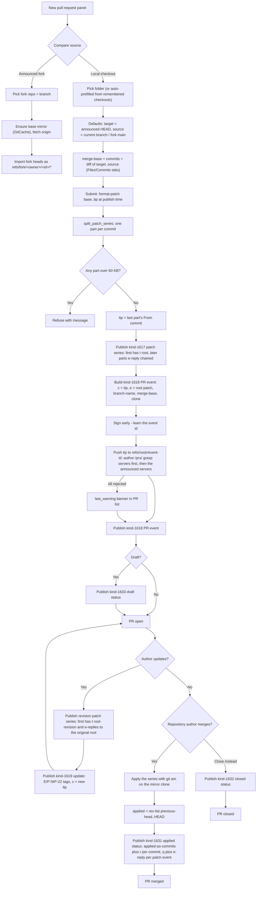
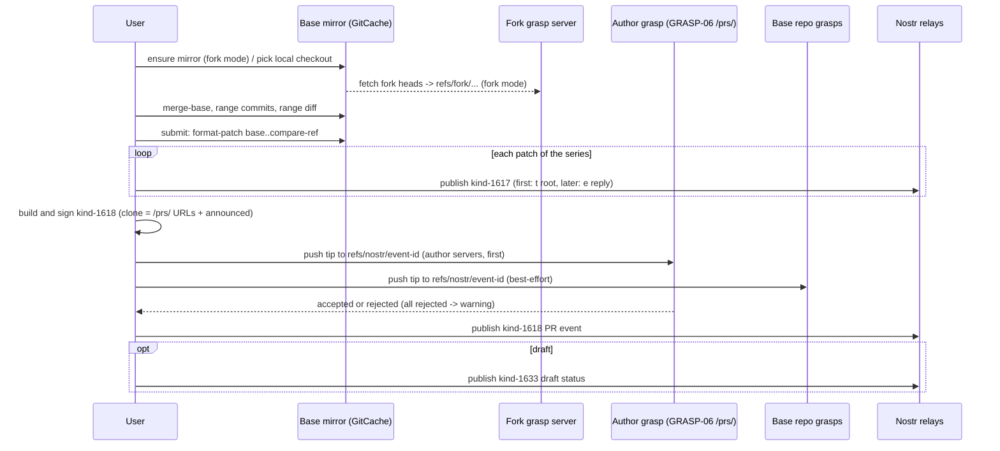
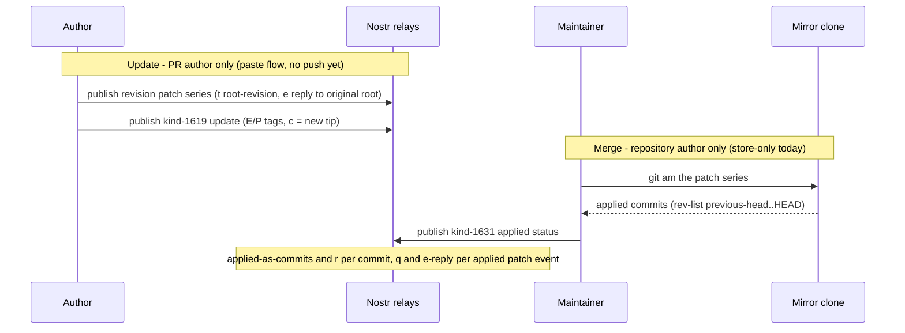
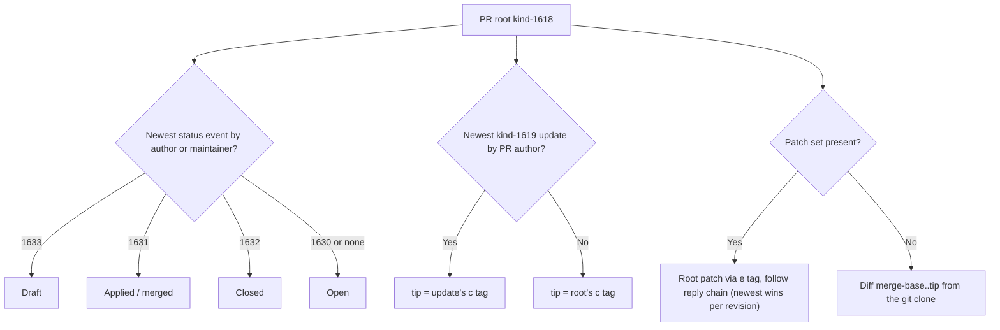

# Pull request flow

How a pull request moves through Signed from creation to merge. A PR is a
kind-1618 root event whose content is the markdown description; its changes
live in a NIP-10-chained series of kind-1617 patch events (one per commit),
whose root the PR references via an `e` tag. Revisions publish new patch
events plus kind-1619 updates; statuses (kind 1630-1633) resolve the PR's
state.

## Whole lifecycle

Key points of the write side:

- **Compare sources** (NIP-34 / GRASP-06 native, no fork identity on the
  wire):
  - *Local checkout*: both branch selectors list a picked folder's
    branches; all git ops run in that folder. Checkouts of the target repo
    are remembered (folder pick + app clones) and matched implicitly
    (origin URL or EUC against the announcement), so the panel prefills the
    freshest one - no folder dialog for the common case.
  - *Announced fork*: the fork's heads are fetched into the target repo's
    GitCache mirror under `refs/fork/<owner-hex>/<id>/*` (private
    namespace; the browser never sees them). "Merge Into" lists the
    mirror's `refs/remotes/origin/*`, "Pull From" the imported fork
    branches, and every git op - merge-base, range diff/commits,
    format-patch, tip push - runs in the mirror, which holds both
    histories. Fork candidates are announcements related to the target by
    `u` tag or shared EUC, own forks first, without `clone` URLs excluded.
- **GRASP-06 hosting**: the tip is pushed under `refs/nostr/<event-id>`
  (nak's convention) to the *author's* grasp servers first -
  `https://<host>/prs/<author-npub>/<repo-id>.git`, resolved from the
  author's kind-10317 grasp list, falling back to the settings defaults -
  then to the base repository's announced grasp servers. The `clone` tag
  lists those `/prs/` URLs first, then the announced clone URLs (fixed
  before signing; dead URLs are inert, the patches stay the source of
  truth). Contributing therefore never depends on the other project's
  servers accepting a push.
- **Patch series**: each commit becomes its own kind-1617 event so no event
  grows past NIP-34's 60 KB guidance; the PR's `c` tag carries the *last*
  commit of the series (the tip), and each part carries its own
  `commit`/`r` tags.
- **Push before publish**: failure is non-fatal - the patch events remain
  the source of truth - and surfaces as a `last_warning` banner.
- **1619 updates are paste-only today** (no repo path holds the new tip's
  objects), so updates are not pushed; hosting them is deferred until the
  update dialog gains a local-checkout source.

## Creating a pull request - event ordering

## Ready to contribute (suggestions)

Local checkouts are matched to announced repositories (remembered records
freshest-first ∪ scanned matches by origin URL or EUC). While a repository's
detail panel is open, each associated checkout is checked off the main
thread: current branch vs its base (announced HEAD, else `main`, else the
first branch), commits ahead, dirty worktrees excluded. A banner in the
repository panel then offers a prefilled New PR panel for the first branch
that is ahead with **no open PR by you** proposing it (`branch-name` tag,
falling back to the `c` tip tag) - NIP-34-native dedupe, refreshed
periodically and whenever the checkouts/announcements change. The panel
never submits anything on its own; suggestions only navigate and prefill.

## Updating and merging

## Reading side

Reader rules that keep the flow consistent:

- **Status**: only status events by the root author or a repository
  maintainer count; the newest wins, `Open` is the default.
- **Tip**: only kind-1619 updates by the PR author move the tip - a
  stranger's update is ignored.
- **Diff**: the patch set is preferred (NIP-34 `e`-linked chain); PRs from
  other clients without patch events fall back to diffing
  `merge-base..tip` in the local clone. Fetching tips from `clone` URLs
  (ngit `pr checkout` analog) is not implemented yet.
