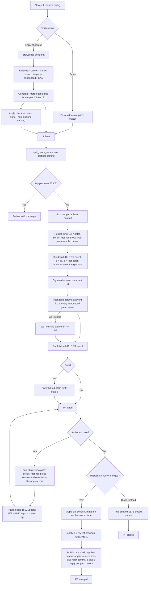
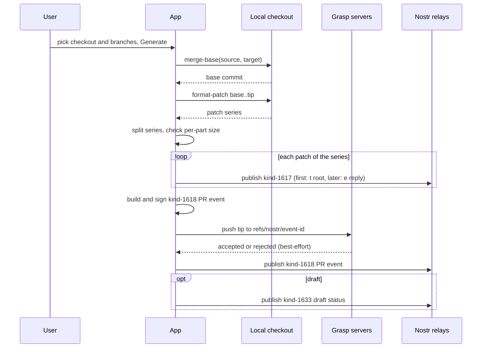
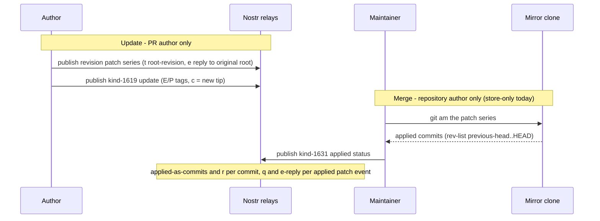
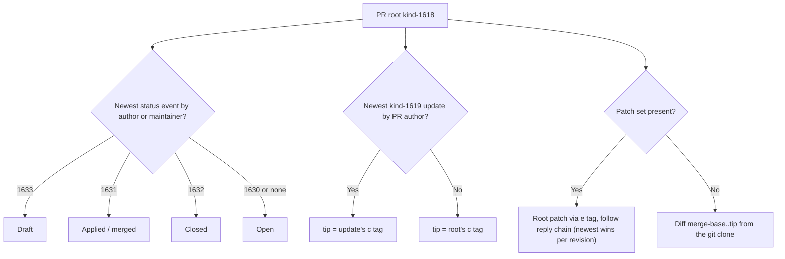

# Pull request flow

How a pull request moves through Signed from creation to merge. A PR is a
kind-1618 root event whose content is the markdown description; its changes
live in a NIP-10-chained series of kind-1617 patch events (one per commit),
whose root the PR references via an `e` tag. Revisions publish new patch
events plus kind-1619 updates; statuses (kind 1630-1633) resolve the PR's
state.

## Whole lifecycle

Key points of the write side:

- **Merge base**: only computable in the local-checkout path
  (`signed_git::merge_base`); the paste path publishes none. The dialog
  reuses it at submit only while the patch textarea is unchanged.
- **Patch series**: each commit becomes its own kind-1617 event so no event
  grows past NIP-34's 60 KB guidance; the PR's `c` tag carries the *last*
  commit of the series (the tip), and each part carries its own
  `commit`/`r` tags.
- **Push before publish**: the tip is pushed to every announced grasp
  server under `refs/nostr/<event-id>` (nak's convention) so the announced
  `clone` URLs really can serve the commit. Failure is non-fatal — the
  patch events remain the source of truth — and surfaces as a
  `last_warning` banner.

## Creating a pull request - event ordering

## Updating and merging

## Reading side

Reader rules that keep the flow consistent:

- **Status**: only status events by the root author or a repository
  maintainer count; the newest wins, `Open` is the default.
- **Tip**: only kind-1619 updates by the PR author move the tip — a
  stranger's update is ignored.
- **Diff**: the patch set is preferred (NIP-34 `e`-linked chain); PRs from
  other clients without patch events fall back to diffing
  `merge-base..tip` in the local clone.
