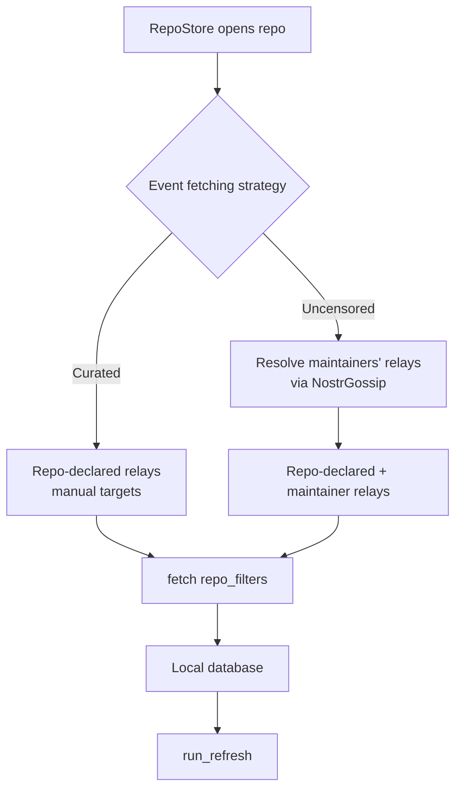

# Proposal: Event Fetching Strategy (`Curated` / `Uncensored`)

Status: proposal, not implemented. Verified against `docs/backend-audit.md`;
read that document first.

References studied:

- GitWorkshop `main` @ `420c0c3`
  (`git clone nostr://npub15qydau2hjma6ngxkl2cyar74wzyjshvl65za5k5rl69264ar2exs5cyejr//gitworkshop`).
- rust-nostr @ `b230cecf9dbb38e0228e6fff4544ed9d261326fc` from `Cargo.lock`.
  Every `nostr*` crate, including `nostr-gossip` and `nostr-gossip-memory`,
  resolves to that single revision.

## Goal

Add a global setting controlling which relays `RepoStore` queries for a
repository's activity, mirroring GitWorkshop's "Event Fetching Strategy":

- **Curated** (`repo`): only the relays declared in the repository
  announcement.
- **Uncensored** (`outbox`): the repository's declared relays plus every
  maintainer's relays, resolved through the NIP-65 outbox model.

## GitWorkshop reference

Source paths are relative to the cloned repository.

- `src/services/settings.ts`: `RelayCurationMode = "repo" | "outbox"`,
  persisted to `localStorage`, default `"outbox"` (the adjacent doc comment
  wrongly says `repo`; the constant is authoritative).
- `src/pages/Settings.tsx` (`RelayCurationSection`, `CURATION_OPTIONS`): two
  selectable cards, "Curated" and "Uncensored".
- `src/hooks/useResolvedRepository.ts` (layers 3-4):
  - `repoRelayGroup` (`RepositoryRelayGroup`): the repo announcement's
    `relays` tag. The **Curated** frontier.
  - `extraRelaysForMaintainerMailboxCoverage`: a delta relay group built from
    every maintainer's NIP-65 **outbox + inbox** relays, excluding relays
    already in `repoRelayGroup`. The **Uncensored** addition.
- `src/services/nostr.ts`:
  - `resolveMailboxes(pubkey)` reads NIP-65 kind `10002` with a 3 s timeout and
    caps to `MAX_RESOLVED_RELAYS = 5` per direction.
  - `nip34RepoLoader` / `nip34SupplementalRelayLoader` subscribe to the base
    **and** extra groups in `outbox` mode, and additionally query each
    discovered item's **author** inbox relays (`MAX_AUTHOR_INBOX_RELAYS = 3`).
  - Deletions come from base + extra relays in `outbox` mode.

## How the pinned Nostr SDK handles NIP-65

The SDK ships a full NIP-65 outbox model. `signed` configures it but, as of
the audit, no code path exercises it: every fetch uses an explicit relay list.

- `crates/signed_nostr/src/backend.rs` builds the client with
  `.gossip(NostrGossipMemory::unbounded())` and
  `.gossip_config(GossipConfig::default().no_background_refresh())`.
- `nostr-sdk/src/client/builder.rs`:
  - `GossipConfig { limits, allowed, sync/fetch timeouts, fetch_chunks, background_refresh }`.
    `GossipRelayLimits` defaults: read 3, write 3, hint 1, most-used 1,
    NIP-17 3, per user. `GossipAllowedRelays` gates onion/local/plain-TLS, not
    read/write.
  - `no_background_refresh()` disables the periodic refresher that re-fetches
    NIP-65 lists for tracked and DB-seen keys.
- `nostr-sdk/src/client/api/req_target.rs`: `ReqTarget::auto` (from a `Filter`,
  `Vec<Filter>`, or `[Filter; N]`) vs `ReqTarget::manual` (from a relay map or
  `(relay, filters)` pairs).
- `nostr-sdk/src/client/api/util.rs::build_targets` and
  `nostr-sdk/src/client/api/sync.rs`:
  - **Auto** target + gossip configured -> filters are broken down by NIP-65.
  - **Manual** target (e.g. `client.sync(f).with(urls)`, or an explicit
    `HashMap<RelayUrl, Vec<Filter>>`), or gossip unset -> no breakdown.
- `nostr-sdk/src/client/gossip/updater.rs::gossip_break_down_filter`:
  - Extracts pubkeys via `Filter::extract_public_keys`
    (`nostr/src/filter/mod.rs`), which reads **only `authors` and `#p`**.
  - Ensures those pubkeys' NIP-65 lists are fresh (`ensure_gossip_public_keys_fresh`
    syncs kind `10002` over `DISCOVERY | READ` relays), then breaks the filter
    down (`gossip/resolver.rs::break_down_filter`):
    - `authors` only -> each author's **write** relays (+ hints, + most-received).
    - `#p` only -> each pubkey's **read** relays (+ hints, + most-received).
    - both -> union of read + write relays.
    - neither (`Other`) or no relay found (`Orphan`) -> the pool's **read**
      relays (`pool/mod.rs::read_relay_urls`).
  - Resolved gossip relays are added with `RelayCapabilities::GOSSIP`
    (`relay/capabilities.rs`), which does **not** include `READ`.
- `gossip/nostr-gossip/src/lib.rs` exposes the public `NostrGossip` trait:
  `get_best_relays(pubkey, BestRelaySelection, GossipAllowedRelays)`, plus
  `process`. `NostrGossipMemory` (re-exported via
  `nostr_gossip_memory::prelude`) implements it, so a retained handle can
  resolve a pubkey's relays directly. It is a pure store read: it does not
  fetch the kind `10002` itself. The store is primed by the freshness step of
  an Auto request (or by any kind `10002` that arrives for another reason),
  and marks a key outdated 24 h after its last fetch attempt.
- `client.send_event(event)` without `.broadcast()` is itself NIP-65 aware:
  with gossip configured it resolves the author's outbox and the `p` tags'
  inboxes. `signed` calls `.broadcast()` everywhere, so publishing goes to the
  pool's write relays and is unaffected by this setting.

### What this means for repository filters

`RepoStore::repo_filters` mixes filter shapes. It is the **filter** (not the
event) that `extract_public_keys` reads, so filter tags decide what the SDK can
resolve:

- announcement + state: `.author(owner).identifier(id)` -> has `authors`, so an
  Auto request resolves the owner's **write** relays.
- `activity(addr)`: `.coordinate(addr)` only (`#a`). The events do carry the repo
  owner in a lowercase `p` tag, per NIP-34 - issues `1621`, patches `1617`, PRs
  `1618`, PR updates `1619`, statuses `1630..=1633` (see the SDK's
  `nostr/src/nips/nip34.rs` builders and `RepoStore::set_status` /
  `publish_patch_series`) - but the filter never asks for `p`, so
  `extract_public_keys` is empty and the filter is classified `Other`.
- `deletions_for_repo(addr)`: one `.author(owner)` filter (owner write relays)
  and one `.coordinate(addr)` filter (`Other`).

Adding `.pubkey(owner)` (or all `effective_maintainers()`) to the activity
filter makes an Auto request resolve those pubkeys' **read** relays (the
`#p`-only branch, plus hints and most-received). Two caveats:

- `Filter::pubkey` ANDs with `.coordinate`. Root kinds and statuses carry the
  owner's `p`, per the SDK's `nostr/src/nips/nip34.rs` builders and
  `RepoStore::set_status` / `publish_patch_series`, but kind-1111 comments set
  `p` to the parent author (`nostr/src/nips/nip22.rs::as_vec` emits the root
  as uppercase `E`/`K`/`P` and the parent as lowercase `e`/`k`/`p`), which for
  a top-level comment is the issue/PR author, not the repository owner. A
  single `#a` + `#p` filter can drop comments. Keep them as two filters (a `#a`
  filter plus a `#p` filter, unioned in the database) or accept the loss.
- `#p` yields the **read** (inbox) relays only. GitWorkshop's extra group is
  outbox **and** inbox, so covering the write side still needs an explicit
  target.

## Current behaviour in `signed`

Global discovery is unchanged: `RepoListStore::subscribe_remote`
(`crates/signed_state/src/repos.rs`) syncs `all_announcements`, `all_states`,
and `deletions` from `BOOTSTRAP_RELAYS`.

Per-repository fetching in `crates/signed_state/src/repo.rs`:

- `RepoStore::subscribe_remote` -> `Backend::subscribe_bootstrap`, a one-shot
  REQ of `repo_filters` on `BOOTSTRAP_RELAYS`. It passes an explicit
  `HashMap<&str, Vec<Filter>>`, i.e. a **Manual** target, so gossip is skipped.
- `RepoStore::connect_announced_relays` -> `Backend::connect_repo_relays`,
  which connects the announcement's `relays` tag and negentropy-`sync`s
  `repo_filters` with `.with(relays.iter())`, again a **Manual** target.
- `RepoStore::run_refresh` reads results back from the local database.

Net effect: a repository's activity and per-repo deletions are fetched from the
global bootstrap relays and its announced relays. Although `signed` configures a
gossip store, **every current fetch path uses manual targets and bypasses the
SDK's NIP-65 handling**.

## Proposed behaviour



- **Curated**: fetch `repo_filters` from the announcement's `relays` tag only.
- **Uncensored**: additionally fetch the same filters from every
  `Announcement::effective_maintainers()`'s NIP-65 write + read relays.

Announcements, state events, and global deletions keep arriving from the global
`RepoListStore` bootstrap sync in both modes.

### Recommended: an Auto request plus a Manual request

Both can run on the same `Client`. They are independent - the pool supports
concurrent subscriptions and syncs, and events deduplicate in the database. Use
each for what it is good at:

1. **Auto**: pass filters straight to `client.subscribe(filters)` /
   `client.sync(filter)` (no `.with(...)`). Broadening the author-scoped
   filters (announcement, state, author-scoped deletions) to
   `effective_maintainers()` resolves each maintainer's NIP-65 **write** relays;
   adding `.pubkey(..)` to the activity filter (see above) resolves their
   **read** relays. This request also drives `ensure_gossip_public_keys_fresh`,
   populating the gossip store. That side effect is what makes step 2 possible
   at all, so the Auto request must run before resolution; resolution is a
   pure store read.
2. **Manual**: the activity filter cannot reach maintainers' **write** relays
   through the Auto path (that branch needs `authors`), so cover the outbox side
   explicitly: resolve each maintainer's relays from the retained gossip handle
   via `get_best_relays(pk, BestRelaySelection::All { .. }, ...)`, then
   negentropy-`sync` through the existing `Backend::connect_repo_relays`. `All`
   returns the union of read, write, hint and most-received relays, i.e.
   GitWorkshop's outbox **and** inbox. Because this leg targets the whole
   filter, it also covers comments that an `#a` + `#p` filter would drop.

Retain the gossip store handle so step 2 can resolve relays:

```rust
let gossip = Arc::new(NostrGossipMemory::unbounded());
let client = ClientBuilder::default().gossip(gossip.clone()) /* ... */ .build();
```

Store `gossip` (as `Arc<NostrGossipMemory>`) on `Backend`, then call
`gossip.get_best_relays(..)` per maintainer, union the results, drop relays
already in `repo_relays`, and track the rest in a new
`mailbox_relays: HashSet<RelayUrl>`.

Prefer splitting by filter shape (author-scoped -> Auto, coordinate-scoped ->
Manual) to avoid duplicate REQs. Sending the full `repo_filters` through both is
also valid; the database dedups events, at the cost of re-querying overlapping
relays.

### Variant: Auto only

Drop the manual maintainer request and pass `repo_filters` directly to
`client.subscribe(filters)` / `client.sync(filter)`, adding `.pubkey(..)` to the
activity filter. Simpler, but activity then reaches only maintainers' **read**
relays (plus hints/most-received); their write relays never receive it.

Recommendation: the Auto + Manual combination for `Uncensored`, matching
GitWorkshop's base + extra relay groups.

## Setting and UI

Add to `crates/settings/src/settings.rs`, following the bare-enum pattern of
`AppearanceMode`:

```rust
#[derive(Debug, Clone, Copy, Default, PartialEq, Eq, Serialize, Deserialize)]
#[serde(rename_all = "snake_case")]
pub enum EventFetchingStrategy {
    /// Only the relays declared in the repository announcement.
    #[default]
    Curated,
    /// Repository relays plus every maintainer's NIP-65 relays.
    Uncensored,
}
```

Add `pub event_fetching: EventFetchingStrategy` to `Settings`, and a section to
`crates/workspace/src/views/sidebar/settings_dialog.rs` rendered from
`settings_view`, reusing the `Select` used by `appearance_section` (or
`setting_block` from `signed_ui` for a two-card layout closer to GitWorkshop).

### Default

Recommend **Uncensored**, matching GitWorkshop. Curated remains the
spam-resistant choice. Note the default changes what existing users fetch.

## Files to change

- `crates/settings/src/settings.rs` - enum and `Settings` field.
- `crates/workspace/src/views/sidebar/settings_dialog.rs` - new section.
- `crates/signed_nostr/src/backend.rs` - retain the `NostrGossipMemory` handle;
  optionally reconsider `no_background_refresh`.
- `crates/signed_state/src/backend.rs` - store the gossip handle; expose a
  maintainer-relay resolver using `get_best_relays`; reuse `connect_repo_relays`.
- `crates/signed_state/src/repo.rs` - strategy-aware `subscribe_remote` /
  `connect_announced_relays`, new `connect_maintainer_relays`, new
  `mailbox_relays` field.
- `crates/signed_core/src/filters.rs` - `relay_list(public_keys)` filter for the
  freshness trigger. Note `ensure_gossip_public_keys_fresh` is private to the
  client; an Auto request naming the pubkeys is the public way to trigger it, so
  this helper is only useful as part of an Auto filter list.

## Open questions / decisions

1. **Activity `#p` shaping.** Add a second `.pubkey(maintainers)` activity
   filter so the Auto leg reaches maintainer inboxes, or keep the activity
   filter coordinate-only? The manual leg already reaches read and write relays
   for the whole filter, so comments are covered either way; this only decides
   how much the Auto leg contributes.
2. **Bootstrap REQ in Curated mode.** Recommended: drop it for this repository
   (global `RepoListStore` still covers announcements, state, deletions).
   Alternative: keep it and make the setting purely additive.
3. **Gossip freshness.** Trigger kind `10002` on demand per repo, or re-enable
   the SDK background refresher? Background refresh is currently disabled in
   `signed_nostr/src/backend.rs`.
4. **Runtime changes.** Re-fetch on `SettingsStore` edit (subscribe
   `RepoStore`), or apply on next open?
5. **Per-item author inbox relays.** GitWorkshop also queries each discovered
   item author's inbox relays in `outbox` mode. Larger change; propose a phase 2.

## Testing

- Unit-test maintainer-relay resolution: given maintainers and a gossip store
  seeded with kind `10002`, assert the resolved, deduped relay set reaches
  `connect_repo_relays`.
- Assert Curated uses only the announced relays.
- Keep the `settings` round-trip tests updated for the new field.

## Phasing

1. Setting, UI, and gossip-handle plumbing.
2. Curated wiring (bootstrap REQ gating) + Uncensored maintainer relay fetch.
3. Runtime re-fetch on setting change.
4. (Optional) per-item author inbox relays.
