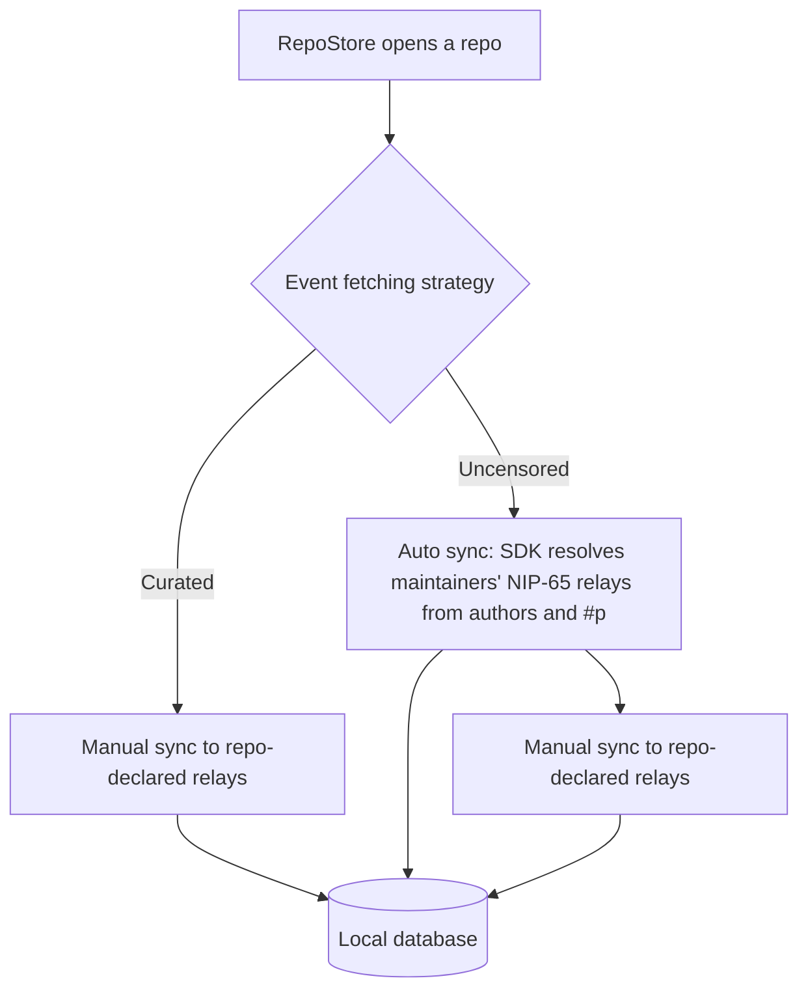

# Plan: Event Fetching Strategy (`Curated` / `Uncensored`)

Status: implementation plan, not implemented. This document replaces the
earlier proposal of the same name; it keeps the verified background from it
and `docs/backend-audit.md` (authoritative for current behaviour).

Cross-checked against:

- rust-nostr at the revision from `Cargo.lock`,
  `b230cecf9dbb38e0228e6fff4544ed9d261326fc` (local checkout
  `~/.cargo/git/checkouts/nostr-619b808bb247a9ed/b230cec`).
- GitWorkshop at `420c0c3`.

## Goal

Mirror GitWorkshop's "Event Fetching Strategy" for the per-repository fetches
in `RepoStore`:

- **Curated**: only the relays declared in the repository announcement.
- **Uncensored**: the repository's declared relays plus every maintainer's
  NIP-65 relays.

Global discovery is unchanged in both modes: `RepoListStore` keeps syncing
announcements, states and deletions from `BOOTSTRAP_RELAYS`.

## GitWorkshop reference

- `src/services/settings.ts:197-210`: `RelayCurationMode = "repo" | "outbox"`,
  persisted to `localStorage`, default `"outbox"` (Uncensored).
- `src/pages/Settings.tsx:85-100`: two selectable cards, "Curated" and
  "Uncensored".
- `src/hooks/useResolvedRepository.ts`: `repoRelayGroup` is the announcement's
  `relays` tag. `extraRelaysForMaintainerMailboxCoverage` is a delta group of
  every maintainer's NIP-65 outbox + inbox relays, excluding relays already in
  the repo group, capped at `MAX_MAILBOX_RELAYS_PER_USER = 3` per direction
  (`addMailboxRelaysToGroup`). The pubkey set is the announcement chain's
  `discoveryPubkeys` (maintainers, moderators, owner).
- Gating: `src/hooks/useNip34Loaders.ts:447` and
  `src/pages/repo/RepoLayout.tsx:319-360` only subscribe the item loaders to
  the maintainer group when the mode is `outbox`. Curated never touches
  maintainer relays.

## Current behaviour in `signed`

`crates/signed_state/src/repo.rs`:

- `subscribe_remote` -> `Backend::subscribe_bootstrap`: one-shot REQ of
  `repo_filters` on `BOOTSTRAP_RELAYS` (manual target).
- `connect_announced_relays` -> `Backend::connect_repo_relays`: add and
  connect the announcement's `relays` tag, then negentropy-`sync`
  `repo_filters` (manual target). Deduped by the `repo_relays` set. Called
  from `new`, `announce`, and on every announcement change in `run_refresh`.
- `run_refresh` also fetches comments (`filters::comments_for`) and statuses
  (`filters::statuses_for`) for each newly seen root from bootstrap +
  `repo_relays`.
- No fetch path uses NIP-65: the gossip store is configured but never
  consulted (`docs/backend-audit.md`, section 2).

## Design



1. **Curated stays exactly what the code does today**: bootstrap REQ plus the
   manual announced-relay sync.
2. **Uncensored adds one SDK Auto sync.** No relay URLs are resolved, stored,
   or tracked, and no kind `10002` events are fetched or parsed by `signed`:
   the SDK's NIP-65 gossip targeting resolves the maintainers' relays per
   request (`client.sync(filter)` with no `.with(..)`, verified in
   `nostr-sdk/src/client/api/sync.rs:151-166` and
   `api/util.rs:12-29`). The existing manual announced-relay sync stays for
   the repo's own relays in both modes.
3. **The filters must name the maintainers.** Gossip resolution is driven by
   `Filter::extract_public_keys` (`nostr/src/filter/mod.rs:591`), which reads
   only `authors` and the lowercase `#p` tag:

   | Filter shape | Auto target |
   | --- | --- |
   | `authors` only | each author's NIP-65 **write** relays |
   | `#p` only | each pubkey's NIP-65 **read** relays |
   | both | union of read and write relays |
   | neither | the pool's read relays |

   Today's `repo_filters` resolve nothing for this purpose: the
   announcement/state filters carry only the owner in `authors`, and the
   activity filter is `#a`-only, so it is classified `Other` and falls back to
   the pool's read relays. Uncensored therefore sends a separate
   maintainer-shaped filter set to the Auto sync.

4. **Maintainer filter set** (Uncensored only):

   ```rust
   /// Filters the SDK resolves through NIP-65 gossip in Uncensored mode.
   ///
   /// Gossip reads pubkeys from `authors` and the lowercase `#p` tag only,
   /// so every filter names the owner and the maintainers.
   fn maintainer_filters(addr: &RepoAddr, maintainers: &[PublicKey]) -> Vec<Filter> {
       let mut pubkeys = maintainers.to_vec();
       // NIP-34 events tag the announcement author, which may not be a
       // maintainer for subordinate forks.
       if !pubkeys.contains(&addr.public_key) {
           pubkeys.push(addr.public_key);
       }

       vec![
           // Announcement and state events, including co-maintainer states,
           // resolved to write relays.
           Filter::new()
               .kinds([Kind::GitRepoAnnouncement, Kind::RepoState])
               .authors(pubkeys.clone())
               .identifier(addr.identifier.clone()),
           // Activity tagging a maintainer, resolved to their read relays.
           Filter::new()
               .kinds(filters::ACTIVITY_KINDS)
               .coordinate(addr)
               .pubkeys(pubkeys.clone()),
           // Activity authored by a maintainer, resolved to their write relays.
           Filter::new()
               .kinds(filters::ACTIVITY_KINDS)
               .coordinate(addr)
               .authors(pubkeys.clone()),
           // Deletions authored by a maintainer, resolved to write relays.
           Filter::new()
               .kinds([Kind::EventDeletion, Kind::RequestToVanish])
               .authors(pubkeys),
       ]
   }
   ```

   `maintainers` is `Announcement::effective_maintainers()`, already computed
   by `run_refresh`. Because the announcement/state filter names every
   maintainer, co-maintainer state events (kind `30618`) land in the local
   database. They are not displayed yet: `run_refresh` reads state through
   the owner-only `filters::state` (`docs/backend-audit.md`, finding 3).

5. **The manual leg is unchanged**: `subscribe_bootstrap` plus
   `connect_announced_relays` keep covering bootstrap and repo-declared
   relays. Per-root follow-ups (`comments_for`, `statuses_for`) also stay
   as-is.

6. **Default: Uncensored**, matching GitWorkshop
   (`DEFAULT_RELAY_CURATION_MODE = "outbox"`). Flagged under "Decisions"
   because it changes what existing users fetch.

### Coverage

- The `#p` activity filter finds roots and statuses that tag a maintainer
  (NIP-34 root events and statuses tag the owner) on the maintainers' read
  relays.
- The `authors` activity filter finds maintainer-authored events (issues,
  PRs, patches, comments, statuses) on their write relays. `signed`'s
  comments and statuses carry the `a` tag
  (`comment_builder`, `set_status`, `publish_applied_status`), so this filter
  does not drop them.
- Comments whose parent author is not a maintainer are not matched by the
  `#p` filter, but they are published to the parent author's inbox, not to a
  maintainer's relays; maintainer-authored comments are still caught by the
  `authors` filter.
- Not covered: status events without an `a` tag published to a maintainer's
  outbox. Per-root `#e` filters carry no pubkeys, so they cannot resolve
  through gossip; GitWorkshop covers these with per-item supplemental
  queries (out of scope below).

## Changes

### 1. Setting, `crates/settings/src/settings.rs`

Follow the bare-enum pattern of `AppearanceMode`:

```rust
/// Which relays `RepoStore` queries for a repository's activity.
#[derive(Debug, Clone, Copy, Default, PartialEq, Eq, Serialize, Deserialize)]
#[serde(rename_all = "snake_case")]
pub enum EventFetchingStrategy {
    /// Only the relays declared in the repository announcement.
    Curated,
    /// Repository relays plus every maintainer's NIP-65 relays.
    #[default]
    Uncensored,
}
```

Add `pub event_fetching: EventFetchingStrategy` to `Settings`.

### 2. Settings UI, `crates/workspace/src/views/sidebar/settings_dialog.rs`

- Options: `SelectOption::new("curated", "Curated")` and
  `SelectOption::new("uncensored", "Uncensored")`.
- Add an `event_fetching: Entity<SelectState<Vec<SelectOption>>>` field to
  `SettingsControls`, seeded from the persisted value, and a
  `SelectEvent::Confirm` subscription that maps the value to the enum and
  calls `store.edit(|settings| settings.event_fetching = strategy, cx)`.
- Add an `event_fetching_section` next to `appearance_section`, using
  `setting_row` with the title "Event Fetching Strategy" and a description of
  both modes, and insert it in `settings_view`.

### 3. Backend, `crates/signed_state/src/backend.rs`

New method next to `connect_repo_relays`:

```rust
/// Sync filters through the SDK's NIP-65 gossip targeting.
///
/// `client.sync(filter)` without `.with(..)` is an Auto request: the SDK
/// resolves each filter's `authors` and lowercase `#p` pubkeys to their
/// NIP-65 relays, connects them, and negentropy-syncs there.
pub fn sync_auto(&mut self, filters: Vec<Filter>, cx: &mut Context<Self>) {
    let client = self.client.clone();

    cx.spawn(async move |_this, _cx| {
        for filter in filters {
            if let Err(e) = client.sync(filter).await {
                log::warn!("gossip relay fetch failed: {e}");
            }
        }
        Ok::<(), Error>(())
    })
    .detach();
}
```

Errors stay log-only, like `connect_repo_relays`; `BackendEvent::Synced` is
deliberately not emitted (it would refresh `RepoListStore` for repo-level
traffic).

### 4. `RepoStore`, `crates/signed_state/src/repo.rs`

New field, initialized empty in `new` and `new_local`:

```rust
/// Maintainers already synced through gossip in Uncensored mode.
synced_maintainers: HashSet<PublicKey>,
```

New methods after `connect_announced_relays`: `maintainer_filters` (listed
under Design) and

```rust
/// In Uncensored mode, sync this repository's maintainer-shaped filters
/// through the SDK's NIP-65 gossip targeting.
fn sync_maintainer_relays(&mut self, maintainers: &[PublicKey], cx: &mut Context<Self>) {
    let strategy = settings::SettingsStore::try_global(cx)
        .map(|store| store.read(cx).settings().event_fetching)
        .unwrap_or_default();
    if strategy != EventFetchingStrategy::Uncensored {
        return;
    }

    let Some(addr) = self.addr.clone() else {
        return;
    };

    if !maintainers
        .iter()
        .any(|pk| !self.synced_maintainers.contains(pk))
    {
        return;
    }
    self.synced_maintainers.extend(maintainers.iter().copied());

    let filters = Self::maintainer_filters(&addr, maintainers);
    let backend = Backend::global(cx);
    backend.update(cx, |backend, cx| backend.sync_auto(filters, cx));
}
```

Hook into `run_refresh`, in the foreground update after
`connect_announced_relays`:

```rust
let maintainers = this
    .announcement
    .as_ref()
    .map(Announcement::effective_maintainers)
    .unwrap_or_default();
this.sync_maintainer_relays(&maintainers, cx);
```

Notes:

- `SettingsStore::try_global` keeps wasm safe: the settings store is only
  installed by the desktop app (`desktop/src/main.rs:21`).
- No new crate dependencies: `signed_state` already depends on `settings` and
  `nostr_sdk`.

## Tests

- `crates/settings`: extend `json_roundtrip_preserves_everything` and
  `partial_json_merges_with_defaults` for `event_fetching` (snake_case
  values, default).
- `crates/signed_state/src/repo.rs`, `mod tests`: unit-test
  `maintainer_filters`: every filter names the owner and maintainers via
  `authors` or `#p` (the announcement/state filter included), activity
  filters carry the `#a` coordinate, and the owner is added for a
  subordinate fork.
- `cargo test -p settings -p signed_state` and
  `cargo check -p signed_workspace` for the UI.
- Manual smoke: open a repository whose activity exists only on a
  maintainer's relays (not on the announced relays or bootstrap) in both
  modes.

## Decisions

1. **Default.** Uncensored, to match GitWorkshop. Curated preserves today's
   relay traffic; flipping the default is a one-line change.
2. **Bootstrap REQ stays in Curated.** It is the index path that keeps
   repositories with unreachable announced relays usable. Strict GitWorkshop
   parity (repo relays only in Curated) is possible later but is a behaviour
   change unrelated to the option itself.
3. **Read and write coverage is approximated by two activity filters** (`#p`
   and `authors`) rather than a resolved "all maintainer relays" set. The SDK
   resolves the relay sets per filter shape; `signed` stores no relay URLs.
4. **The announcement/state Auto filter names every maintainer plus the
   owner.** This also fetches co-maintainer state events into the local
   database; showing them is a separate display-side change.
5. **Runtime switching.** `sync_maintainer_relays` reads the setting on every
   `run_refresh`, so switching to Uncensored applies at the next refresh
   without a restart. Switching back stops new Auto syncs but does not undo
   relays already resolved by the gossip pool.
6. **Gossip pool growth.** Auto requests add resolved relays with
   `RelayCapabilities::GOSSIP` and never remove them for the session
   (`docs/backend-audit.md`); accepted, as the SDK is designed this way.
7. **Errors stay log-only**, consistent with existing background fetches.

## Out of scope

- Status events without an `a` tag published to maintainer outboxes
  (GitWorkshop's per-item supplemental loader).
- Per-item author inbox relays
  (`src/services/nostr.ts:1042,1070`, `MAX_AUTHOR_INBOX_RELAYS = 3`).
- Co-maintainer state display: co-maintainer states are fetched (decision 4)
  but `run_refresh` still reads state through the owner-only
  `filters::state` (`docs/backend-audit.md`, finding 3).
- Gating or replacing the bootstrap REQ in Curated mode.

## Phasing

1. Setting enum, field and settings tests. **Done.**
2. Settings UI control.
3. `Backend::sync_auto` and `RepoStore::sync_maintainer_relays` with the
   maintainer filter set, plus the filter unit test.
4. `cargo test` / `cargo check`, then a manual smoke test.
